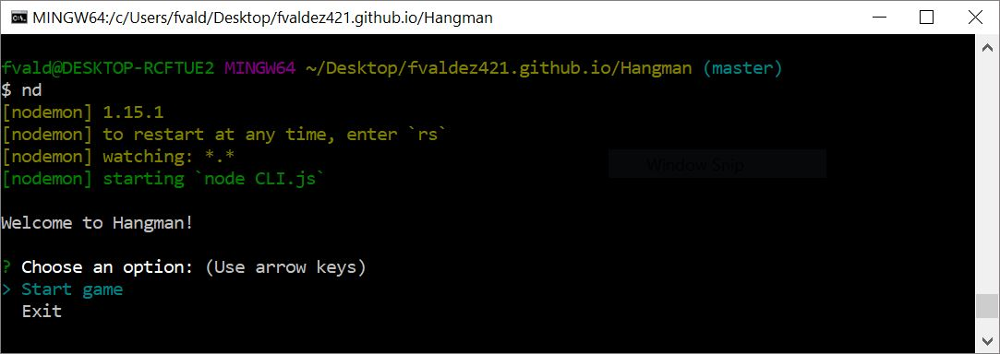
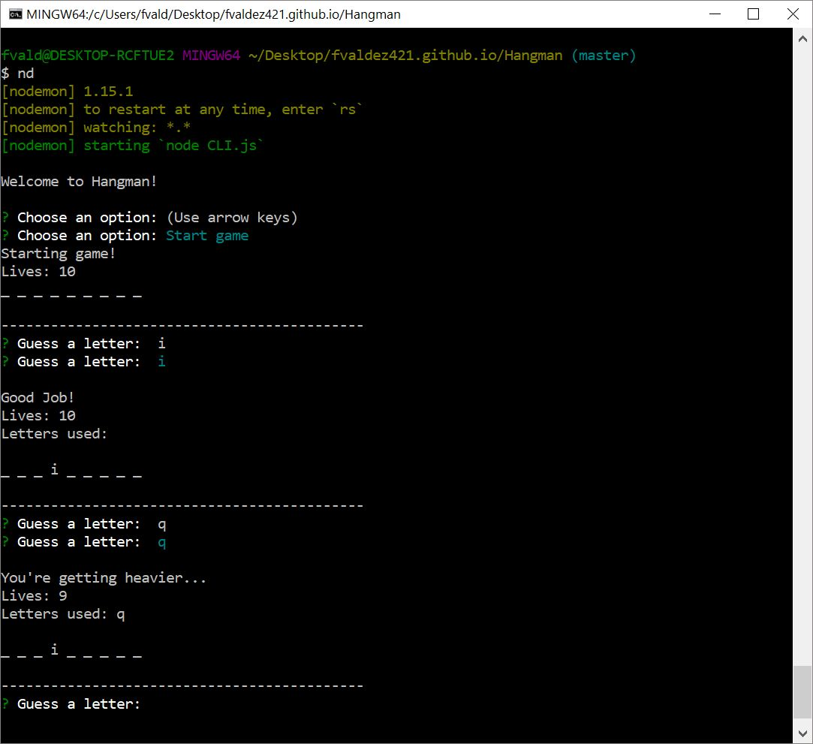
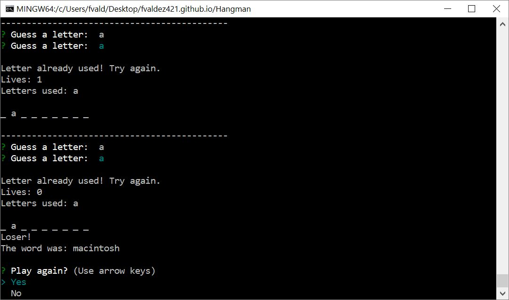

<h2>Hangman</h2>

	This is a one-player command-line version of Hangman. It randomly chooses one technology based word from a word bank and prompts the user for guesses.

	This game is built using Node.js. It is buit in such a way that displays the use of object oriented programming in order to access multiple space consuming functions in a more organized, simpler format.

<h4>Snapshots</h4>

<h4>Dependencies</h4>
<ul>
	<li>Inquirer</li>
	<li>Cli-Color</li>
</ul>

<h4>To Run</h4>
<ol>
	<li>Open Command line and navigate to a desire directory and clone repository down to your machine.</li>
	<li>Navigate inside directory and run "npm install" to download and install all the depedencies.</li>
	<li>Once this is complete, you may run "node CLI.js" or "nodemon" if you have it installed.</li>
</ol>